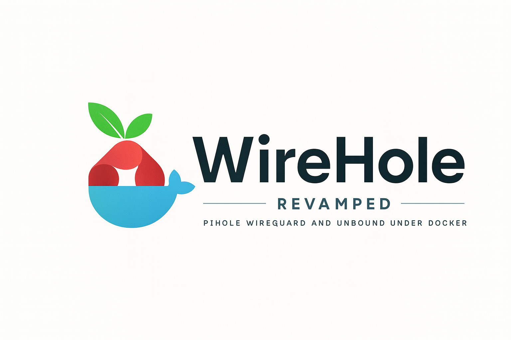

# 🕳️ Wirehole: Secure, Ad-Free, and Private Internet

[](https://opensource.org/licenses/MIT)


## ✨ Overview

Wirehole is a self-hosted solution combining **WireGuard VPN**, **Pi-hole** (ad blocking), and **Unbound** (recursive DNS) to provide a private, ad-free, and secure internet experience. It's designed for users who want to control their DNS, block ads network-wide, and encrypt their traffic from anywhere.

## 🚀 Features

* **WireGuard VPN:** Fast, modern, and secure remote access.
* **Pi-hole:** Network-wide ad and tracker blocking.
* **Unbound (Recursive DNS):** Direct, private DNS resolution.
* **Docker-Compose:** Easy deployment and management.

## 🏗️ Architecture

```
+------------------+     +-----------------+     +-----------------+
|   VPN Clients    |<--->|   WireGuard     |---->|     Pi-hole     |
| (Mobile/Laptop)  |     |  (wg-easy)      |<----+ (Ad-blocking,   |
+------------------+     |                 |     |   DNS Filtering)|
                         +-----------------+     +-----------------+
                                                     |
                                                     V
                                               +-----------------+
                                               |     Unbound     |
                                               | (Recursive DNS) |
                                               +-----------------+
                                                     |
                                                     V
                                            +-----------------+
                                            |   Internet DNS  |
                                            |   (Root Servers)|
                                            +-----------------+
```

## 📋 Prerequisites

* **Docker Compose:** [Installation Guide](https://docs.docker.com/engine/install/)

## ⚙️ Installation & Setup

1. **Clone the Repository:**
    ```bash
    git clone https://github.com/Turtlecute33/WireHole-Revamp.git
    cd WireHole-Revamp
    ```

2. **Edit `.env` File:**
    Open the `.env` file in the project root and update the placeholder variables:

    ```env
    # Pi-hole Web UI Password
    FTLCONF_webserver_api_password='your_pihole_web_password'
    
    # WireGuard Public IP/Hostname (Your server's public IP address or domain)
    SERVERURL='your_server_public_ip_or_hostname'
    
    # WireGuard Web UI Password
    WGUI_PASSWORD='your_wireguard_web_password'

    # Set your timezone for Pi-hole and Unbound
    TZ='Your/Timezone'  # Example: Europe/London or America/New_York
    ```
    *Choose strong, unique passwords, and set the correct timezone.*

3. **Start Services:**
    ```bash
    docker-compose up -d
    ```

4. **Verify:**
    ```bash
    docker-compose ps
    ```
    All services should be `Up`.


## 🛠 Troubleshooting

### Port 53 Already in Use

If you see an error like:

```
failed to bind host port for 0.0.0.0:53: address already in use
```

It means another service (often `systemd-resolved`) is using port 53.

**Fix:**
```bash
sudo systemctl stop systemd-resolved
sudo systemctl disable systemd-resolved
```

Then edit `/etc/resolv.conf` to use a public DNS server:
```bash
sudo nano /etc/resolv.conf
```
Replace its contents with:
```
nameserver 1.1.1.1
```
Save the file and restart Docker:
```bash
sudo systemctl restart docker
```


## 🚀 Usage

* **Pi-hole Admin:** Access at `http://your_server_public_ip_or_hostname/admin` (using `FTLCONF_webserver_api_password`).
* **WireGuard Web UI:** Access at `http://your_server_public_ip_or_hostname:51821` (using `WGUI_PASSWORD`) to add clients and generate configurations.
    * **Note:** When generating client configs, set DNS to `10.2.0.100` (Pi-hole’s internal IP).
* **Connect Clients:**
    1. Install WireGuard client: [wireguard.com/install](https://www.wireguard.com/install/)
    2. Generate client config via WireGuard Web UI.
    3. Import config (QR code for mobile, `.conf` file for desktop).
    4. Activate VPN.


## 🔧 Configuration Details

* **`docker-compose.yml`**: Defines network (`10.2.0.0/24`) and port mappings (`80`, `53`, `51820`, `51821`). Adjust if conflicts occur.
* **Volumes**: All service configurations and data (Unbound, Pi-hole, WireGuard) are persisted in the `unbound/`, `etc-pihole/`, `etc-dnsmasq.d/`, and `wireguard-easy-data/` directories.
* **`.env`**: Stores passwords, server URL, and timezone.


## 📄 License

This project is licensed under the MIT License - see the [LICENSE](LICENSE) file for details.
